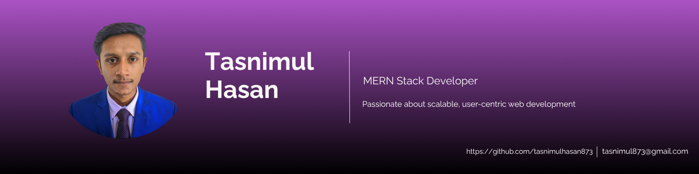

<!-- Banner -->

# Hi there, I'm Md. Tasnimul Hasan 👋  
### 🧑‍💻 Frontend Developer | MERN Stack Learner  

---

## 🧠 About Me  
🎓 CSE student at Green University of Bangladesh  
💡 Passionate about web development and AI  
🌱 Currently exploring Next.js and Tailwind CSS  
🚀 Dreaming to build my own startup

---

## 🔥 Current Activities  
- Working on a tourism website using React  
- Exploring prompt engineering for AI  
- Learning backend development with Node.js  

---

## 🚀 Skills

  

---

## 🌐 Connect with Me  
  
  

---

## 📊 GitHub Stats

