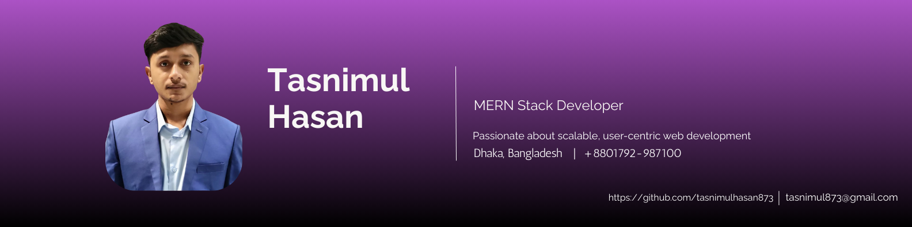

<!-- Banner -->

# 👋 Hi there, I'm Md. Tasnimul Hasan  
### 🧑‍💻 MERN Stack Developer  

---

## 🧠 About Me  
🎓 CSE student at Green University of Bangladesh  
💡 Passionate about Web Development and Artificial Intelligence  
🚀 Currently exploring Next.js and Tailwind CSS  
🎯 Ambitious to build my own tech startup  

---

## 🔥 Current Activities  
- 🚧 Working on a **tourism website** using React  
- 🤖 Exploring **prompt engineering** for AI  
- 🛠️ Learning **backend development** with Node.js  
- 🌍 Preparing for **MERN stack job interviews**

---

## 🚀 Skills  

### 🖥️ Frontend  

  

### 🧪 Backend  

  

### 🛠️ Tools & Platforms  

  

---

## 🌐 Connect with Me  
  
  

---

## 📊 GitHub Stats  
  
  

---

